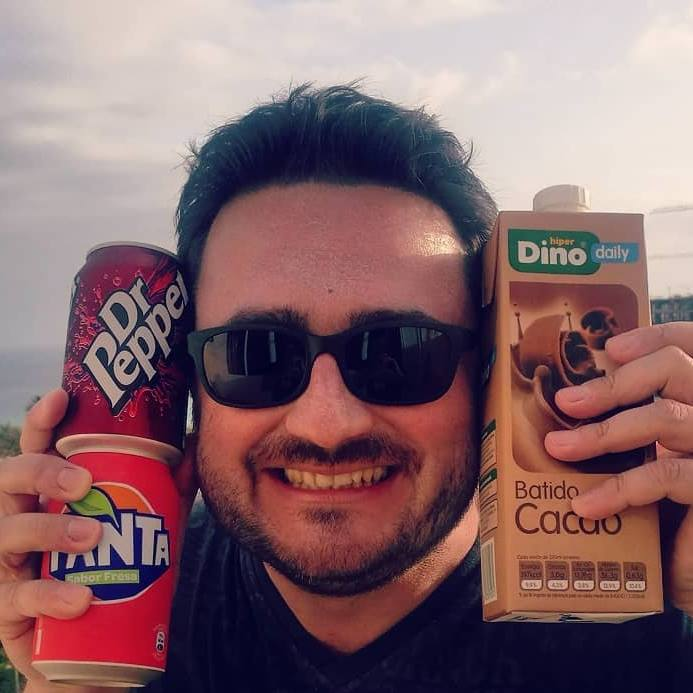
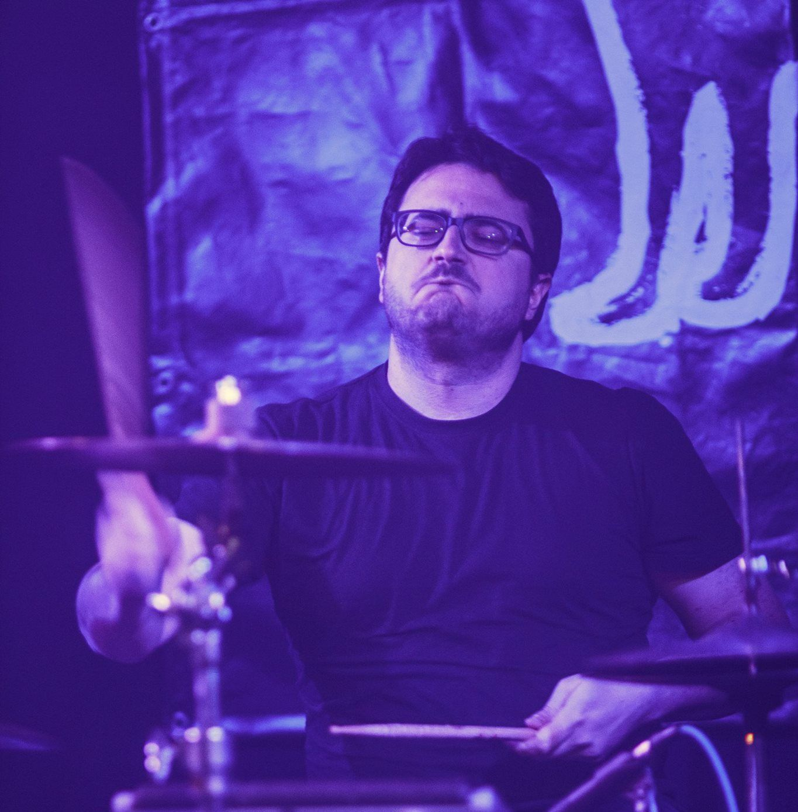
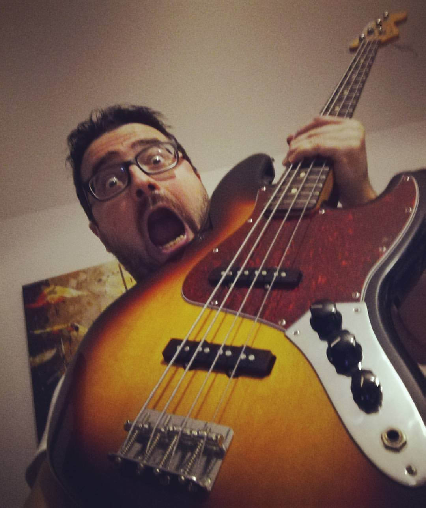
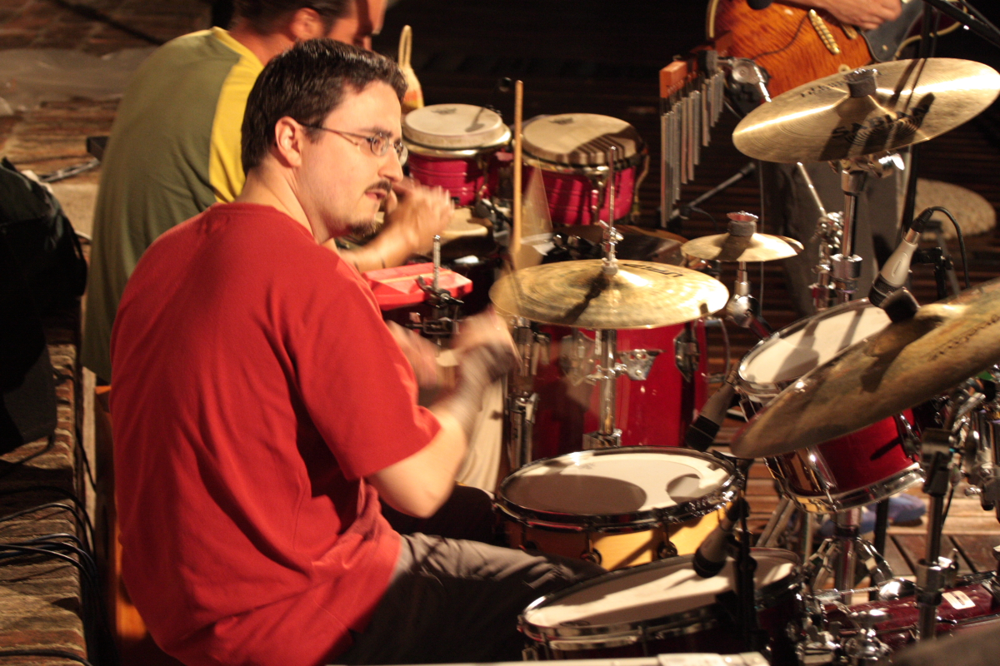
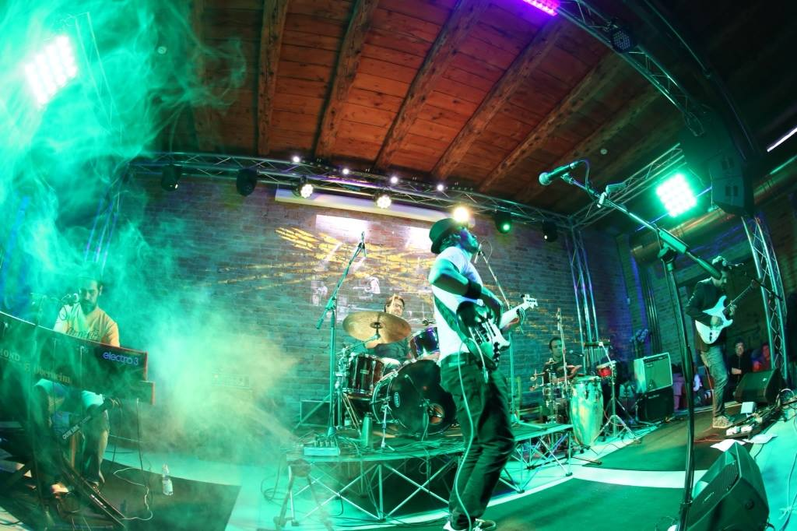
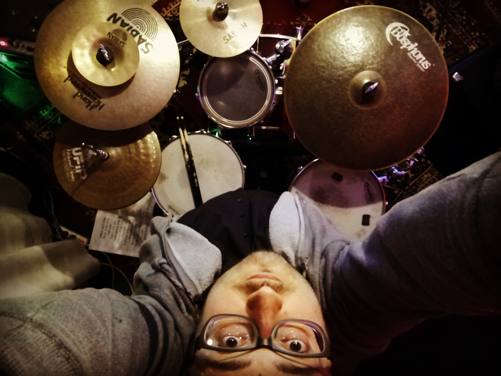
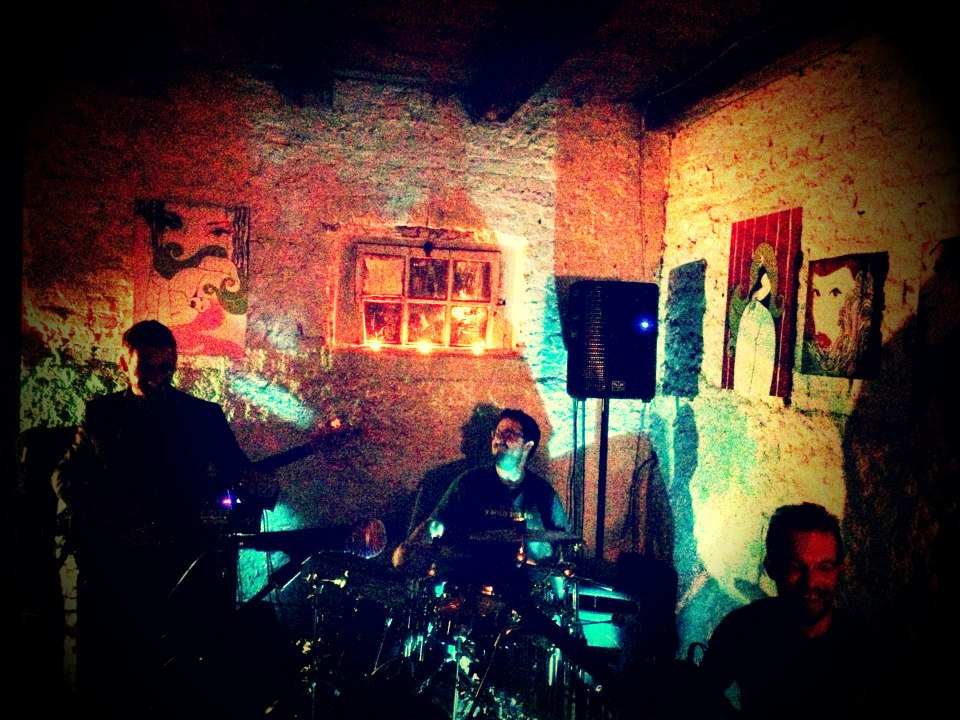

   

Questo blog esiste perché **ogni tanto mi viene voglia di scrivere**, soprattutto di informatica e musica che ho fatto, ma ogni tanto anche di qualcos'altro.  

Mi metto al PC e scrivo, una cosa lenta, quasi meditativa.  
Volendo potrei dettare al computer e ottenere il testo automaticamente in una frazione del tempo, ma invece io **digito su una tastiera perché il sapore è tutto diverso**, digiti poi cancelli correggi riscrivi costantemente, dopo qualche secondo ma anche dopo qualche giorno quando mi rileggo.  
E invece di usare Word o altri strumenti avanzati pieni di bottoni e automatismi, **scrivo in un editor di testo**, non proprio in Blocco Note perché insomma dai, però comunque testo crudo e diretto, e quello che metto a schermo arriva online così come le dita l'hanno digitato, senza troppe intermediazioni di correttori ortografici o intelligenze artificiali. Proprio old school insomma.

Di solito scrivo quando voglio **prendere nota di qualcosa che ho fatto o che mi è piaciuto**, oppure perché voglio mettere in ordine alcune idee: dicono che non conosci un argomento finché non sai spiegarlo a qualcuno, ecco ogni tanto c'è un po' di questo dentro ad un post, un intento divulgativo che mi fa piacere coltivare.

Ci trovi anche **quasi tutta la [musica](/blog/categories/musica) che ho registrato** con batteria, basso, chitarra o con il PC. Sono ricordi di una fetta importante di vita, e mi piace poter far ascoltare cosa ho suonato.

Clicca [**"Archivi"**](/blog/archivi) per la panoramica sull'intero contenuto del blog.

    
