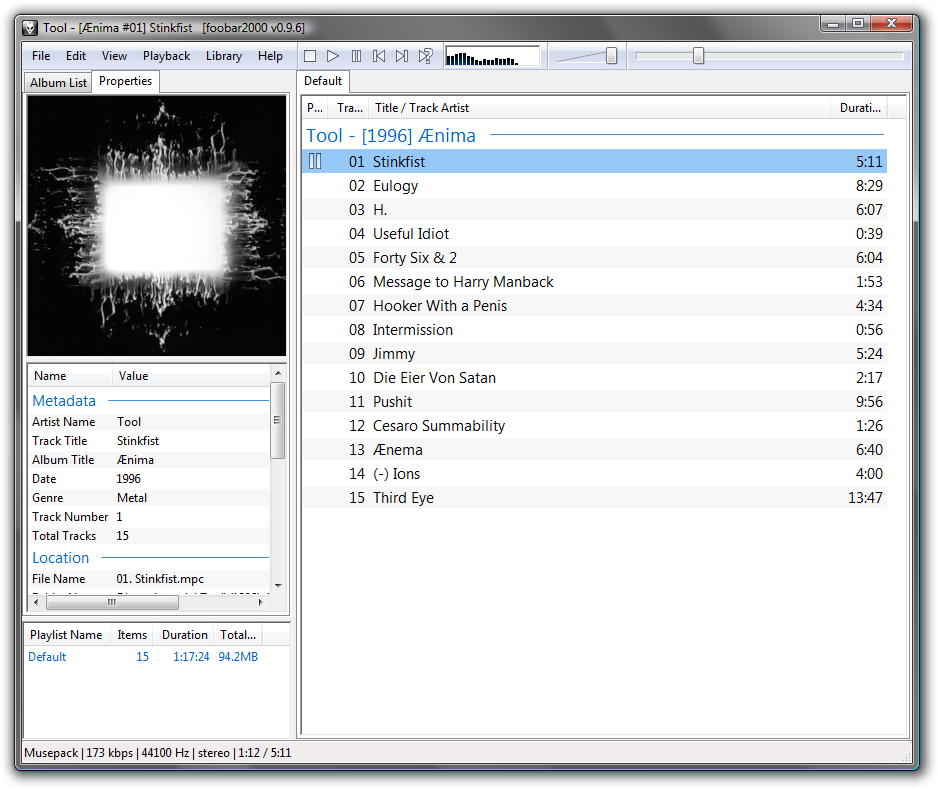

Rispondo qui ad una domanda di un amico via email, metti mai che torni buono a qualcun altro.

> _che usi come player? punti di forza?_

Per ascoltare la musica al PC (e per tenerla ordinata) uso da tempo con soddisfazione [foobar2000](http://www.foobar2000.org/). Non ricordo quando e perché ho iniziato (prima usavo da anni il classico WinAmp)... probabilmente devo aver letto da qualche parte che foobar2000 era il software più apprezzato dagli smanettoni, o qualcosa del genere - questo tipo di pubblicità mi attira inesorabilmente. :-)

Le caratteristiche sono ovviamente descritte sul sito [http://www.foobar2000.org](http://www.foobar2000.org/), ma per quanto mi riguarda i punti di forza che sfrutto quasi quotidianamente sono:

- supporto nativo per tanti formati, tra cui quelli che incontro più spesso (.mp3 .ogg .flac .wav, e anche .cue)
- transcodifica (da ogg a mp3, ad esempio)
- tagging (per quanto rudimentale, fa il suo)
- supporto all'mp3gain
- azioni "furbe" personalizzabili e associabili ai tasti (esempi: Alt+N per passare alla "Next" canzone, Alt+M per Muovere il file in una cartella, Alt+D per "Delete"-are un brano...)
- supporto ai tasti "multimedia" del mio notebook (play stop mute next previous eccetera)
- possibilità di installarlo portable
- plugin opzionali per fare un milione di cose (più o meno utili ^\_^)
- è freeware.

Dato che nasce un po' scarno di suo, segnalo anche che tra le funzioni c'è la "skinnabilità" - non la uso, perché tendenzialmente non è che se ascolto musica devo _guardare_ il software... sto sicuramente facendo altro, oppure sto proprio _ascoltando_ e basta.

Non mi vengono in mente motivi per cui usare un'alternativa, al momento, quindi... consigliato. ;-)
