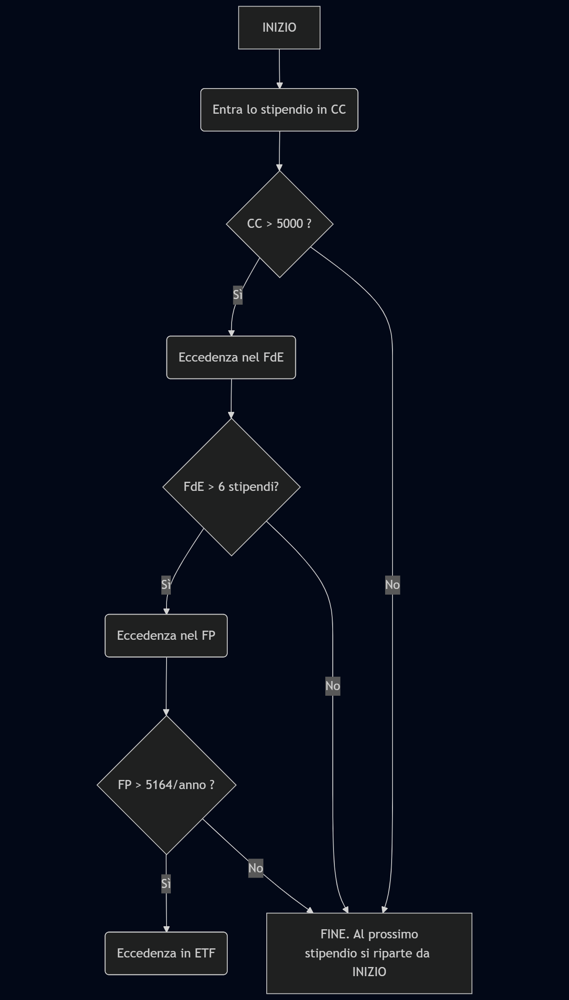

Usando gli ingredienti descritti nel post #TODO, ecco qua sotto la mia "ricetta".  

La disciplina è importante, quando si tratta di investire.  
Per chi è indisciplinato come me, la soluzione migliore per mantenere la rotta è avere uno schema semplice da seguire in modo quasi automatico, senza doverci pensare.  
Questo è il mio schema.

Ovviamente è solo il mio personale metodo, e non è un suggerimento su cosa dovresti fare tu.

# Impostazione iniziale

Prima di spostare il primo euro, ho predisposto tutto il necessario:

* **Formazione:** ho ascoltato The Bull (le prime 25 puntate circa sono quelle fondamentali), e ho guardato il corso "Educati e finanziati" di Coletti su YouTube.  

* **Chiusura posizioni precedenti**: Ho analizzato i prospetti informativi di un paio di prodotti di investimento che avevo acquistato anni fa senza informarmi opportunamente, ho confrontato i rendimenti ed i costi con quelli attesi dagli investimenti in FPA ed ETF, ed è emersa la conclusione limpida: meglio chiudere tutto e spostare il capitale investito su ETF, prima di farmi mangiare ulteriori rendimenti da costi ricorrenti davvero troppo alti.  

* **Estinzione di debiti/finanziamenti**: Non era il mio caso, ma in questa fase iniziale ci metterei anche questo, tranne l'eventuale mutuo casa se fatto ad un tasso inferiore a quello attuale della BCE: inutile pensare ad investire per portare a casa un rendimento positivo, se dall'altra parte ci sono finanziamenti con un tasso di interesse che combatte contro questo rendimento. 

* **Conto corrente**: Tengo il conto che ho già, nonostante sia più costoso di tanti altri disponibili. La banca è tra le più solide in Italia, quindi sono a posto così per ora.  
Segnalo solo che il trasferimento di un conto corrente ad un altro istituto è gratuito per legge e la nuova banca si occupa di tutto, compreso il trasloco delle domiciliazioni (già sperimentato personalmente anni fa). Resteranno comunque da fare un po' di pratiche come l'attivazione delle nuove carte di debito e di credito e la relativa associazione a PayPal Amazon e simili, prima di chiudere definitivamente il vecchio conto. [Deposifire.com](http://Deposifire.com) può aiutare nella scelta del nuovo conto corrente.

* **Fondo di emergenza**: Ho usato [Deposifire.com](https://deposifire.com/) per scegliere un conto deposito svincolato con il tasso più alto tra quelli disponibili, e l’ho aperto con il solo scopo di contenere metà del mio FdE. L'altra metà ho deciso di parcheggiarla in un ETF monetario, giusto per diversificare.

* **Assicurazioni**: Avevo già provveduto qualche anno fa, e per pigrizia tengo quello che ho, perché sono polizze di una assicurazione nota che esiste da decenni. Devo valutare una LTC, ma ancora non lo ho fatto.

* **FPN**: Avevo già scelto di destinare il mio TFR al FPN. Ho modificato soltanto il comparto, scegliendo quello con la maggiore componente azionaria, dato che mi aspettano ancora 20 anni di lavoro. Cambierò comparto durante i prossimi 20 anni, per aumentare progressivamente il peso della componente obbligazionaria man mano che mi avvicino alla pensione (la cosiddetta allocazione "life cycle").

* **FPA**: Dato che il mio FPN per i miei gusti non ha sufficiente azionario considerando che mi mancano ancora 20 anni alla pensione, e dato che voglio versare fino a 5164€/anno nei FP per approfittare al massimo delle deduzioni, ho usato il sito COVIP per capire quale FPA rispondesse ai requisiti "*costi bassi, disponibilità di un comparto azionario, rendite degli ultimi 10-20 anni elevate*": ne sono usciti subito due vincitori, dei quali solo uno consentiva di fare la pratica di adesione online quindi la scelta è stata ovvia. Ho poi scoperto che su [CiaoElsa.com](https://ciaoelsa.com) è possibile aderire online gratuitamente anche ai fondi pensione che non hanno la procedura nel proprio sito, perché CiaoElsa fa da intermediario… ma ormai avevo già fatto tutto. Amen!

* **Conto titoli**: La mia banca mi offre un conto titoli con costi imbarazzanti, quindi ho deciso di aprirne uno presso un broker. Ho confrontato i broker italiani che operano in regime amministrato (feature obbligatoria per minimizzare burocrazia e potenziali errori nel 730), cercando quello con i costi minori delle transazioni su PAC. Ho scelto Directa. Avevo già un account su Moneyfarm che da qualche tempo consentiva di comprare ETF, ma non di impostare un PAC. Nel 2025 segnalo anche TradeRepublic, che ha delle condizioni molto interessanti.

* **ETF**: Come prima mossa ho investito qualcosa in un singolo ETF azionario globale tra i più noti, scelta che giudico sensata per un orizzonte temporale di più di 10 anni come il mio. Nel frattempo ho continuato a studiare il mio "portafoglio obiettivo", aggiustandolo più volte, introducendo la parte obbligazionaria, un tilt ex-usa ed uno ex-Mag7, e un po’ di oro, e sto facendo i successivi investimenti in modo da tendere a questa allocazione obiettivo.

# Ogni mese

Dopo aver impostato tutto come descritto sopra, ogni mese dopo l’accredito dello stipendio mi preoccupo delle mie finanze seguendo questo ordine - sembra chissà cosa a prima vista, ma è davvero banale:

1. **CONTO CORRENTE**: Porto il saldo del CC al "livello comfort", cioè una cifra che mi consenta di fare le mie spese mensili (casa bollette supermercato abbonamenti carburante assicurazioni eccetera) e di avere un buffer aggiuntivo per eventuali necessità extra: una giacenza media sempre inferiore ai 5000€ mi è molto più che sufficiente, e tra l’altro fa risparmiare i 34€ del bollo annuale sul CC (fonte: [Ministero dell'Economia e delle Finanze](https://www.dt.mef.gov.it/it/news/2012/nuove_disposizioni_bollo_titoli.html)).   
    - Se dopo l’accredito dello stipendio il saldo del CC è inferiore al "livello comfort", allora per questo mese mi fermo qui e non proseguo con le operazioni descritte di seguito; se invece è superiore, allora uso l’eccedenza per il passaggio seguente.

2. **FONDO DI EMERGENZA**: Con l’eccedenza in arrivo dal CC, porto il saldo del FdE verso il "livello comfort", che nel mio caso ho deciso essere pari a 6 stipendi: giudico questa una somma sufficiente a coprire le spese più consistenti che potrebbero capitarmi - ferie, arredamenti, dentista, grandi riparazioni… cose così.  
    - Se il saldo del FdE è inferiore al "livello comfort", allora per questo mese mi fermo qui e non proseguo con le operazioni descritte di seguito; se invece diventasse superiore, allora verso solo la parte necessaria ad andare a livello e uso l’eccedenza per il passaggio seguente.

3. **FONDO PENSIONE**: Verso l’eccedenza residua nel mio FP, verificando di rimanere sempre sotto la soglia di max 5164€/anno (da calcolare sempre tenendo conto anche dei contributi volontario + datoriale nel FPN calcolati sull'intero anno in corso), così da godere del massimo vantaggio fiscale ed avere una parte importante di risparmi investita.  
    - Se ho già raggiunto i 5164€/anno di versamenti nel FP, allora non ci verso più nulla per l’anno corrente, e uso l’eccedenza per il passaggio seguente.

4. **ETF**: Verso l’eccedenza residua nel mio conto titoli, e la uso per acquistare quote degli ETF in portafoglio in modo tale da ribilanciare senza vendere quote, così da minimizzare le commissioni sulle operazioni - anzi le azzero, dato che ho scelto tutti ETF che sono senza commissioni di acquisto nel PAC Directa. Mi sono fatto un semplice foglio di calcolo per aiutarmi a capire quanto la mia allocazione reale si discosta da quella obiettivo, così con un colpo d'occhio capisco cosa acquistare quel mese.

Al netto del tempo dedicato ad informarmi, e una volta aperto CD, FP e conto titoli, oggi **questa gestione mi occupa indicativamente un quarto d'ora al mese**: il tempo di verificare i saldi nelle app, ripetere un bonifico del mese precedente cambiando solo l'importo, e impostare il prossimo investimento del PAC Directa in modo che vengano acquistati gli importi corretti degli ETF che ho a portafoglio.

---

# Disclaimer

Come tutti i contenuti divulgativi che parlano di questi argomenti, è opportuno specificare quanto segue.

> AVVISO IMPORTANTE:  
_Il contenuto di questa pagina non è e non costituisce in alcun modo una consulenza finanziaria personalizzata._  
_Tutte le informazioni, le opinioni, i dati e i pareri espressi in questo articolo sono forniti a scopo puramente informativo e non devono essere interpretati come una raccomandazione all'investimento, un'offerta di acquisto o vendita di strumenti finanziari, o una sollecitazione al pubblico risparmio ai sensi della normativa vigente (es. TUF - Testo Unico della Finanza)._  
_Prima di prendere qualsiasi decisione di investimento, è fondamentale consultare un intermediario o un consulente finanziario abilitato e qualificato che tenga conto della vostra specifica situazione finanziaria, dei vostri obiettivi e della vostra tolleranza al rischio. L'autore e il blog non si assumono alcuna responsabilità per eventuali perdite o danni derivanti dall'utilizzo delle informazioni qui contenute. Ogni decisione è a vostro rischio e pericolo._
