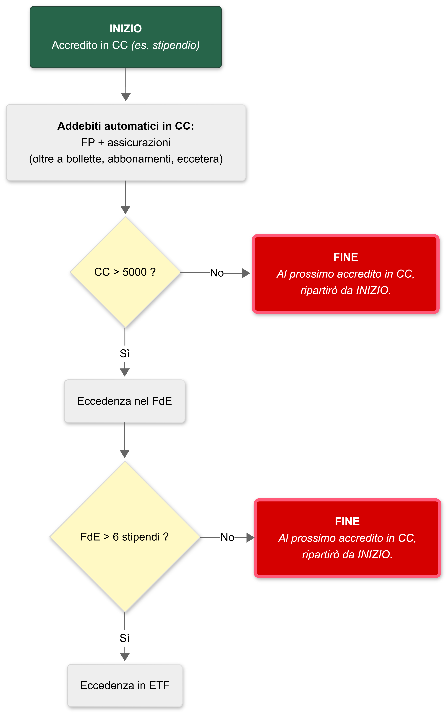

Usando gli _ingredienti_ del post [Strumenti per la finanza personale](), ecco qua sotto la mia _ricetta_.  

  

# Impostazione iniziale

Prima di spostare un euro, ho predisposto tutto il necessario.  
Di seguito, invece di limitarmi alla cronaca cruda di quello che ho fatto, aggiungerò qualche dettaglio utile e metterò in ordine diverso quello che ho fatto, in modo che diventi una specie di vademecum.

## Formazione
Nella quantità di cose sul tema che ho guardato, ascoltato, e letto online, credo che gli autori dei contenuti che seguono siano quelli che centrano meglio l'obiettivo per noi neofiti, combinando chiarezza, precisione, buon senso, e leggerezza.  

1. ["Educati e finanziati" condensato in un'oretta](https://www.youtube.com/watch?v=wMOP4b5saxk): introduzione perfetta ai temi principali, da seguire senza prendere appunti, solo per sgranchire la mente su quanto seguirà.
1. ["**Educati e finanziati**"](https://www.educatiefinanziati.it), il corso vero e proprio di Paolo Coletti.  
Questo ti porterà via un po' più tempo, ma lo stile di Coletti renderà tutto facile e leggero, fidati!  
Il sito contiene sia i video che una dispensa con tutti i contenuti.  
Trovi il corso anche in formato podcast nelle varie piattaforme.
1. [The Bull](https://italia-podcast.it/podcast/the-bull-il-tuo-podcast-di-finanza-personale): se sei consumatore di podcast come il sottoscritto, allora anche "The Bull" di Riccardo Spada merita la tua attenzione.  
Parla soprattutto di temi legati all'investimento.  
Le prime 25 puntate circa sono quelle fondamentali.
1. [Infografiche COVIP sui fondi pensione](https://www.covip.it/per-il-cittadino/educazione-previdenziale/infografiche-sulla-previdenza-complementare): danno velocemente un sacco di informazioni preziose.

## FPN
Il primo tema di cui preoccuparsi secondo me è il fondo pensione.  
Versarci il TFR + il contributo minimo è la scelta ovvia che avevo già fatto molti anni prima, ma non avevo ancora cambiato il comparto: **ho selezionato il comparto con la maggiore componente azionaria**, che mi sembra il più appropriato dato che mi aspettano ancora 20 anni di lavoro.  
Probabilmente cambierò comparto durante i prossimi 20 anni, per aumentare progressivamente il peso della componente obbligazionaria man mano che mi avvicino alla pensione (la cosiddetta **allocazione "life cycle"**).

## FPA
Dato che il mio FPN per i miei gusti non ha sufficiente azionario considerando che mi mancano ancora 20 anni alla pensione, e dato che **voglio versare fino a 5164€/anno nei FP per approfittare al massimo delle deduzioni**, ho usato il sito COVIP per capire quale FPA rispondesse ai requisiti "*costi bassi, disponibilità di un comparto fortemente azionario, rendite degli ultimi 10-20 anni elevate*".  
Ne sono usciti subito due vincitori, dei quali solo uno consentiva di fare la pratica di adesione online quindi la scelta è stata ovvia.  
_Ho poi scoperto che su [CiaoElsa.com](https://ciaoelsa.com) è possibile aderire online gratuitamente anche ai fondi pensione che non hanno la procedura nel proprio sito, perché CiaoElsa fa da intermediario... ma ormai avevo già fatto tutto. Amen!_

## Chiusura posizioni precedenti
Ho analizzato i prospetti informativi di un paio di prodotti che avevo acquistato anni fa (quando ancora non mi interessavo a questi temi), ho confrontato i rendimenti ed i costi con quelli attesi dagli investimenti in FPA ed ETF, ed è emersa la conclusione limpida: meglio chiudere tutto e spostare il capitale investito su ETF, prima di farmi mangiare ulteriori rendimenti da costi ricorrenti davvero troppo alti.  

## Estinzione debiti + eventuale surroga mutuo casa
Non era il mio caso, ma in questa fase iniziale ci metterei anche questo passaggio.
Inutile pensare ad investire per portare a casa un rendimento positivo, se dall'altra parte ci sono finanziamenti per i quali paghiamo un tasso di interesse che combatte contro questo rendimento.  

Riguardo al mutuo casa, se il tasso del tuo mutuo in corso è superiore di qualche decimale rispetto ai preventivi che puoi fare online, allora è senz'altro opportuno chiedere alla tua banca di rivedere le condizioni in modo da allinearsi, altrimenti con pochissimo sforzo e zero spese (grazie al **Decreto Bersani** - cfr. [Wikipedia](https://it.wikipedia.org/wiki/Decreto_Bersani_bis#Surroga_dei_mutui_a_costo_zero) e [il decreto](https://www.normattiva.it/uri-res/N2Ls?urn:nir:stato:decreto.legge:2007-01-31;7) all'articolo 8) puoi surrogare il mutuo trasferendolo alla banca che ti offre il miglior TAEG oggi.

## Budgeting
Per tracciare le mie spese e farmi un'idea di quanto riesco a risparmiare mediamente, ho usato la app [**Wallet** di Budgetbakers](https://budgetbakers.com/en/products/wallet/) perché si collega al mio conto corrente una volta al giorno per leggere saldo e transazioni, le categorizza automaticamente, e fornisce report e statistiche molto utili. Da anni cerco di evitare l'uso del contante, e questa abitudine rende il lavoro di Wallet totalmente automatico, perché ogni singola spesa è una voce già categorizzata e non si perdono informazioni; tutte le poche e piccole transazioni che faccio con i contanti semplicemente non le traccio, ma si può fare molto facilmente inserendole manualmente nella app.  
A livello metodologico, ho deciso di adottare il _reverse budgeting_: do priorità al risparmio nei fondi pensione (obiettivo: 5164€/anno) rispetto alle spese personali e agli investimenti in ETF.  
Il solo fatto di poter controllare le spese in 5 secondi aprendo una app mi ha regalato un certo grado di consapevolezza su come spendo i soldi che prima non avevo, e che mi fa ragionare un po' di più su cosa vale davvero la spesa e cosa no; e trovo utile poter guardare i report automatici a fine mese confrontando i vari mesi a colpo d'occhio.

## Conto corrente
Ho deciso di tenere il conto che ho già, nonostante sia più costoso di tanti altri disponibili. La banca è tra le più solide in Italia, quindi sono a posto così per ora.  

Se avessi dovuto cambiare conto corrente, allora avrei fatto come ho fatto anni fa per scegliere il mio conto attuale: privilegiare la **solidità della banca**, che è misurata da alcuni indicatori (per il 2025 ad esempio c'è [questo articolo di Milano Finanza](https://www.milanofinanza.it/news/quali-sono-le-banche-piu-sicure-ecco-le-pagelle-bce-e-i-dati-di-bilancio-dei-principali-istituti-in-italia-202511211804564119)), e in secondo luogo i **bassi costi**. La disponibilità di una sede fisica vicina credo sia irrilevante oggi, si fa tutto online senza problemi.

Segnalo che il trasferimento di un conto corrente ad un altro istituto è gratuito per legge ([Testo Unico Bancario](https://www.normattiva.it/uri-res/N2Ls?urn:nir:stato:decreto.legislativo:1993-09-01;385), articolo "126 septies") e la nuova banca si occupa di tutto, compreso il trasloco delle domiciliazioni (già sperimentato personalmente anni fa).  
Resteranno comunque da fare un po' di pratiche come l'attivazione delle nuove carte e relativa associazione a PayPal Amazon e simili, prima di chiudere definitivamente il vecchio conto.  
[Deposifire.com](http://Deposifire.com) può aiutare nella scelta del nuovo conto corrente.

## Fondo di emergenza
Ho usato [Deposifire.com](https://deposifire.com/) per scegliere un conto deposito svincolato con il tasso di interesse più alto tra quelli disponibili, e l’ho aperto con il solo scopo di contenere metà del mio FdE.  
L'altra metà ho deciso di parcheggiarla in un ETF monetario, giusto per diversificare.

## Assicurazioni
Avevo già provveduto qualche anno fa, e per pigrizia tengo quello che ho, perché sono polizze di una assicurazione nota che esiste da decenni.  
Devo valutare una LTC, ma ancora non lo ho fatto.

Se non avessi alcuna copertura, allora oggi quasi certamente sceglierei tra le compagnie più grandi che consentono di stipulare tutto online.

## Conto titoli
La mia banca mi offre un conto titoli con costi imbarazzanti, quindi ho deciso di **aprirne uno presso un broker**.  
Ho confrontato i broker italiani che operano in regime amministrato (feature obbligatoria per minimizzare burocrazia e potenziali errori nel 730), cercando quello con i costi minori per le transazioni tramite PAC.  
Ho scelto **Directa**.  
Avevo già un account su Moneyfarm che da qualche tempo consentiva di comprare ETF, ma non di impostare un PAC.  
Nel 2025 è diventato interessante anche **TradeRepublic**, tenendo conto che l'azienda non è italiana.

## ETF
Come primo investimento ho acquistato qualche quota di un ETF azionario globale tra i più noti, scelta che in generale mi sembra sensata per un orizzonte temporale di più di 10 anni come il mio.  
Nel frattempo ho continuato a studiare il mio "portafoglio obiettivo", aggiustandolo più volte in base alle nuove nozioni che imparavo man mano e mettendolo alla prova con decine di backtest su [LazyPortfolioEtf.com](https://www.lazyportfolioetf.com/): oltre alla seconda metà del mio FdE in un ETF monetario, ho introdotto una parte obbligazionaria, un tilt ex-usa, e un po’ di oro, il tutto secondo pesi calcolati sulla base della mia età, del tasso BCE, e del tipo di lavoro che faccio.  
Quando investo acquisto quote degli ETF in modo da tendere a mantenere questi pesi.

# Ogni mese

Dopo aver impostato tutto come descritto sopra, ogni mese dopo l’accredito dello stipendio mi preoccupo delle mie finanze seguendo questo ordine:

## Addebiti automatici
Dato che ho deciso di avere delle coperture assicurative, e di dedurre il massimo ogni anno tramite i versamenti nel fondo pensione, nel mio metodo ho previsto l'**addebito automatico dei premi assicurativi**, e un **versamento mensile regolare nel fondo pensione** tale per cui a fine anno, sommando i miei versamenti + il contributo datoriale, raggiungo precisamente la soglia massima deducibile (i fatidici 5164€/anno).

## Conto corrente
Dopo aver considerato le uscite dovute agli addebiti automatici, verifico se il CC è al mio **"livello comfort"**, cioè una cifra che mi consenta di coprire le mie spese mensili normali (mutuo bollette supermercato abbonamenti carburante eccetera) e di avere un abbondante buffer aggiuntivo per eventuali necessità extra.  
Una **giacenza media sempre inferiore ai 5000€** mi è molto più che sufficiente, e tra l’altro fa risparmiare i 34€ del bollo annuale sul CC (fonte: [Ministero dell'Economia e delle Finanze](https://www.dt.mef.gov.it/it/news/2012/nuove_disposizioni_bollo_titoli.html)).   
- Se dopo gli addebiti automatici il saldo del CC è inferiore al "livello comfort", allora per questo mese mi fermo qui e non proseguo con le operazioni descritte di seguito; se invece è superiore, allora uso l’eccedenza per il passaggio seguente.

## Fondo di emergenza
Con l’eccedenza in arrivo dal CC, porto il **saldo del FdE verso il suo "livello comfort"**, che nel mio caso ho deciso essere pari a 6 stipendi: giudico questa una **somma sufficiente a coprire le spese più consistenti che potrebbero capitarmi** - ferie, dentista, grandi riparazioni, oppure perdita del lavoro e necessità di un buffer che copra le spese in attesa di trovare un nuovo impiego.  
- Se il saldo del FdE è inferiore al "livello comfort", allora per questo mese mi fermo qui e non proseguo con le operazioni descritte di seguito; se invece diventasse superiore, allora verso solo la parte necessaria ad andare a livello e uso l’eccedenza per il passaggio seguente.

## ETF
Verso l’eventuale eccedenza residua nel mio conto titoli, per **acquistare quote degli ETF che ho in portafoglio**.  
Scelgo tra i miei ETF quelli che hanno _perso_ più valore, in modo tale da ribilanciare senza vendere quote, così da tenere a zero le commissioni sulle operazioni e le tasse sulle plusvalenze.  
Mi sono fatto un semplice foglio di calcolo per aiutarmi a capire quanto la mia allocazione attuale si discosta da quella obiettivo, così con un colpo d'occhio capisco quali ETF acquistare.  
Se anche dopo aver acquistato quote qualche componente si discosta (in positivo o negativo) più del 5% dall'allocazione prevista, allora ribilancio più incisivamente anche vendendo quote per riportare tutto in equilibrio.

# Quanto tempo serve per starci dietro?
Al netto del tempo dedicato ad informarmi, e una volta aperto CD, FP e conto titoli, oggi **questa gestione mi occupa indicativamente un quarto d'ora al mese**: il tempo di verificare i saldi nelle app, ripetere un bonifico del mese precedente cambiando solo l'importo, e impostare il prossimo investimento del PAC Directa in modo che vengano acquistati gli importi corretti degli ETF che ho a portafoglio.

---

# Disclaimer

Come tutti i contenuti divulgativi che parlano di questi argomenti, è opportuno specificare quanto segue.

> AVVISO IMPORTANTE:  
_Il contenuto di questa pagina non è e non costituisce in alcun modo una consulenza finanziaria personalizzata._  
_Tutte le informazioni, le opinioni, i dati e i pareri espressi in questo articolo sono forniti a scopo puramente informativo e non devono essere interpretati come una raccomandazione all'investimento, un'offerta di acquisto o vendita di strumenti finanziari, o una sollecitazione al pubblico risparmio ai sensi della normativa vigente (es. TUF - Testo Unico della Finanza)._  
_Prima di prendere qualsiasi decisione di investimento, è fondamentale consultare un intermediario o un consulente finanziario abilitato e qualificato che tenga conto della vostra specifica situazione finanziaria, dei vostri obiettivi e della vostra tolleranza al rischio. L'autore e il blog non si assumono alcuna responsabilità per eventuali perdite o danni derivanti dall'utilizzo delle informazioni qui contenute. Ogni decisione è a vostro rischio e pericolo._
