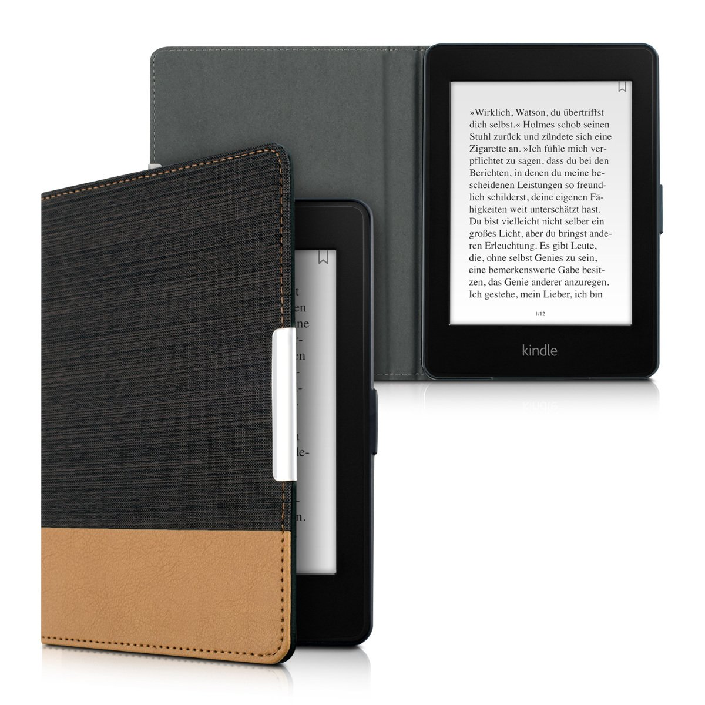

Mi hanno regalato il Kindle Paperwhite di [Amazon](https://www.amazon.it).

Ce l'avevo in [wishlist](http://www.amazon.it/registry/wishlist/34Q9O6MIO49CU?sort=priority) da un bel po': non mi ero azzardato a comprarlo dato che, negli ultimi tempi, non leggevo granché.

Per farla breve: ce l'ho da un mese, e ho letto 5 libri. Certo non tutti dei gran malloppi, anzi. Però _cinque_! Sarà anche l'effetto "novelty"... però son sempre _cinque_! Non ho _mai_ letto 5 libri in un mese.

Quindi ho pensato di scrivere questo articoletto per raccogliere alcune informazioni interessanti per chi ha uno di questi aggeggi.

# Kindle email

Dal PC (per comodità), sono andato su [www.amazon.it/myk](http://www.amazon.it/myk) ed ho impostato come mittente autorizzato la mia email (nella sezione "Elenco e-mail approvate documenti personali").

Questo meccanismo serve per inviarmi gli ebook al Kindle senza averlo fisicamente collegato al PC, ma allegando il/i libri ad una semplice email. E serve anche per una utile estensione di Chrome. Parlo meglio di queste cose più sotto.

# Calibre

Calibre è un software gratuito, open-source, e pure portable. Non è indispensabile utilizzarlo, ma io lo faccio per questi motivi:

- Avere un elenco di tutti gli ebook, ricercabile rapidamente.
- Avere una indicazione sulla lunghezza di un libro, tramite il plugin **[Count](https://www.mobileread.com/forums/showthread.php?t=134000) [Pages](https://www.mobileread.com/forums/showthread.php?t=134000)**.
- Scaricare con pochi click la sinossi e la copertina degli ebook.
- Dare un'occhiata al contenuto degli ebook, prima di inviarli al Kindle.
- Inviarmi gli ebook al Kindle via email con 1 click (con conversione automatica nel formato MOBI - necessaria per sfruttare il "send to email"). IMPORTANTE: questo metodo è l'unico per ottenere questi 2 vantaggi rispetto al copia-e-incolla dell'ebook tramite cavetto USB:
    - _[whispersync](https://www.amazon.it/gp/help/customer/display.html/ref=help_search_1-2?ie=UTF8&nodeId=200911660&qid=1485788698&sr=1-2)_, cioè **sincronizzazione** delle pagine tra i vari dispositivi ed app Amazon Kindle ([per Android](https://play.google.com/store/apps/details?id=com.amazon.kindle) e [per iOS](https://itunes.apple.com/it/app/kindle-leggi-ebook-riviste/id302584613?mt=8)), così da poter proseguire la lettura cambiando dispositivo;
    - visualizzazione **copertina** del libro (che è sempre una cosa carina, invece di avere tutte le copertine piatte e senza grafica).

Devo ancora capire se l'impaginazione del file nativo AZW3 sia migliore rispetto alla sua conversione in MOBI.

# Ebook

Oltre a [comprare gli ebook su Amazon](https://www.amazon.it/ebooks-kindle/b/ref=nav__kbo4?ie=UTF8&node=827182031), è possibile averli già come file (in uno dei formati supportati: AZW3, AZW, LIT, MOBI, EPUB) e copiarli nel Kindle tramite cavetto USB oppure inviandoseli alla propria "Kindle Email" (quest'ultima opzione vale solo per il formato MOBI - usare Calibre per la conversione eventualmente).

E' poi possibile trovare ebook online, ad esempio nell'ottima [community TNTvillage](http://forum.tntvillage.scambioetico.org/) oppure nei circuiti P2P. Attenzione al diritto d'autore però: è necessario possedere la copia cartacea regolarmente acquistata, per poter scaricare la versione ebook dello stesso testo con questi mezzi.

Esistono poi alcuni siti che contengono testi non protetti da diritto d'autore, e perciò liberamente scaricabili: si trovano con una rapida ricerca online.

# Send to Kindle _(per Chrome)_

Dato che come browser su PC utilizzo Chrome, ho installato l'[estensione Send to Kindle](https://chrome.google.com/webstore/detail/send-to-kindle-by-klipme/ipkfnchcgalnafehpglfbommidgmalan). Con questa, è possibile inviare la "conversione" di una pagina web in formato ebook direttamente al proprio Kindle. La uso per certi lunghi articoli di Wikipedia, così me li leggo con calma.

Accedere agli stessi articoli usando il browser integrato nel Kindle _non_ è la stessa cosa: è talmente lento e scattoso da far passare la voglia! Il Kindle va usato solo per la sua funzione di "girare pagina", tutto il resto (digitare URL, compilare un campo di ricerca, cliccare un link, scorrere, zoomare) è un inferno.

# Accessori

Penso che una cover vada presa, sia per ovvio motivo di protezione dello schermo (quando butto il Kindle in valigia non è che mi fidi tanto, senza cover), sia perché secondo me migliora l'impugnatura mentre si legge.

Io dopo aver preso [questa](https://www.amazon.it/gp/product/B017TU6GHE/ref=oh_aui_detailpage_o08_s00?ie=UTF8&th=1), e aver scoperto che è davvero troppo plasticosa per i miei gusti, ho fatto il reso gratuito con Amazon e ho presto [quest'altra](https://www.amazon.it/gp/product/B01ID2Y7M8/ref=oh_aui_detailpage_o04_s00?ie=UTF8&psc=1) che è invece molto bella (anche se un po' spessa, ma a me questo fattore non dispiace affatto per l'impugnatura):

