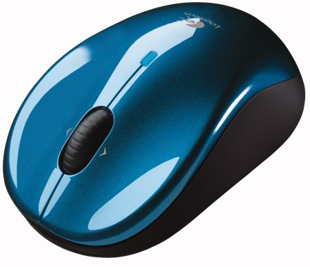

Bello avere il mouse bluetooth:

- niente cavi
- niente ricevitori USB da perdere
- niente porte USB da impegnare

Peccato però per questi dettagli:

- Anche nelle condizioni migliori, c'è una certa minima latenza tra il movimento del mouse e il movimento del puntatore a video. Non tutti se ne rendono conto, e non per tutti si tratta per forza di un problema - ma lo è di certo nei videogame.
- A volte Windows non vede più il mouse quando rientra da uno standby. Quindi bisogna rimuoverlo e ri-aggiungerlo fra i dispositivi. Per fortuna capita solo una volta ogni 10 standby, circa, e ci si mette solo un minuto a sistemare.
- Durante la copia di molti MB tramite WiFi (ad esempio da un altro pc), la risposta del mouse diventa intermittente e lenta, rendendolo quasi inutilizzabile. A quanto ho letto online, pare sia un problema di eccessivo traffico sulla banda dei 2.4GHz, impegnata sia dal bluetooth che dal WiFi.
- Funziona a batterie, quindi è sempre meglio avere un set di scorta in borsa.
- Funziona solo dopo che Windows si è avviato caricando gli opportuni driver. Quindi non è detto che funzioni con tutti i LiveCD (sia Linux che BartPE). E non funziona nel BIOS (poco male).

Tirando le somme, direi che per quanto mi riguarda vincono i PRO sui CONTRO in ogni caso. Aggiornamento 2013: i CONTRO sono così snervanti che ho cambiato idea!
