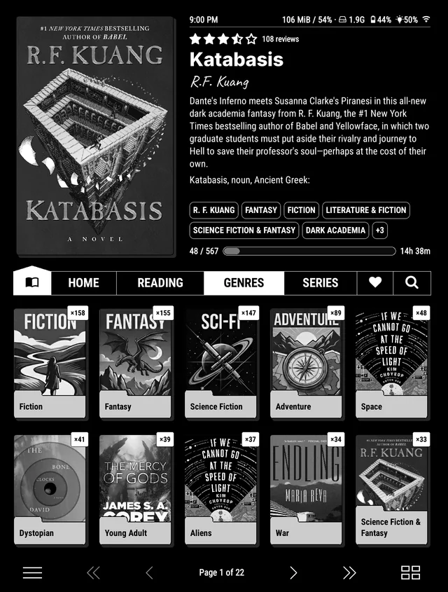
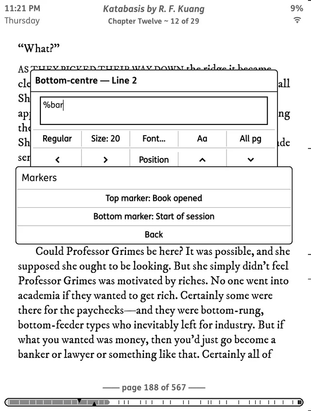
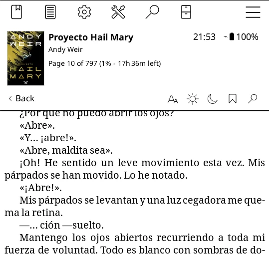
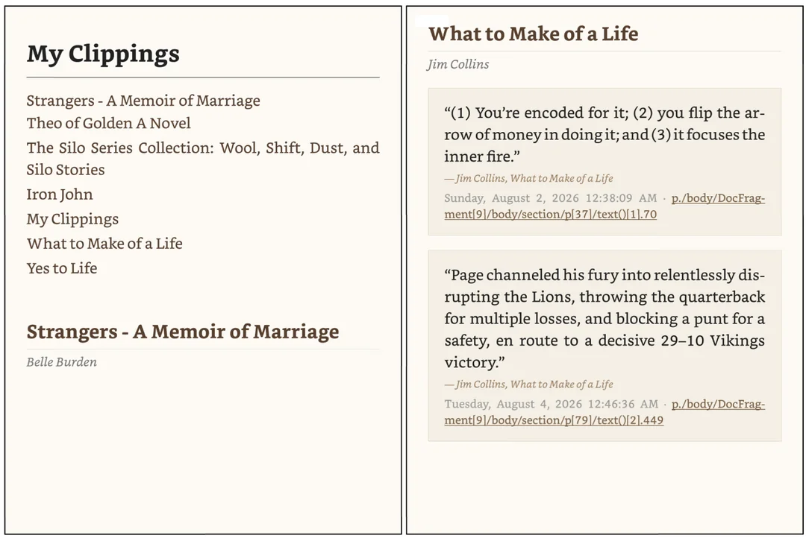

Nel 2026 scopro per caso che sul [mio vecchio Kindle regalatomi 10 anni prima](), e ancora perfettamente funzionante, posso installare [KOReader](https://koreader.rocks).

KOReader è un software opensource per leggere ebook che si può installare in quasi tutti i dispositivi Kindle, Kobo, PocketBook e Android, e offre una tonnellata di possibilità in più rispetto all'interfaccia nativa Amazon, tra cui le più interessanti per me sono:
- completo **distacco dall'ecosistema Amazon** (togliere cose dal cloud e conservarle dove decido io per tutto il tempo che desidero senza dipendere da scelte altrui, più passa il tempo e più mi sembra interessante)
- possibilità di installare plugin per **estendere ulteriormente le funzionalità** - questa cosa da sola vale tutto lo sforzo, vedi più sotto
- **ricerca** di parole/frasi (evidenziando il testo oppure digitando) su dizionari multilingua scaricabili in locale, traduttori, Wikipedia, e AI (tramite plugin)
- download di **feed RSS** per leggerli come "mini-libri"
- accesso a **Dropbox** per leggere libri memorizzati su cloud
- supporto alla **lettura di PDF** con reflow del testo, OCR, e raddrizzamento della scansione
- **controllo tipografico avanzato** (font, margini, kerning, orientamento dello schermo, e varie altre opzioni che il software Amazon non prevede)
- **connessione wifi al PC**, per gestire i contenuti sia tramite [SSH](https://it.wikipedia.org/wiki/Secure_Shell) sia tramite Calibre senza armeggiare con il cavetto
- lettura di **formati ebook aggiuntivi** (anche se, con le possibilità di conversione offerte da Calibre, il formato dell'ebook diventa subito un non-problema)

Figurati se non mi vien voglia di provare!  
Ecco quello che ho fatto.  

# Jailbreak + installazione
Primo prerequisito per installare KOReader è aver fatto il _jailbreak_ del dispositivo.  
È una procedura facile e guidata passo dopo passo su https://kindlemodding.org.  

Nello stesso sito, la procedura termina con le indicazioni per installare KOReader, tramite un paio di comandi elementari da digitare direttamente sul Kindle.  

# Plugin
Ho ovviamente sperimentato un bel po' di plugin per KOReader, soprattutto per modificare l'interfaccia utente, ma anche per altre funzioni collaterali.  
Ti elenco quelli che sto usando ancora oggi, dopo opportuna scrematura - necessaria anche per evitare di appesantire troppo l'hardware molto limitato del mio ebook reader.

## Storefront
Appena installato KOReader, prima ancora di staccare il Kindle dal PC, la cosa da fare subito secondo me è installare [Storefront](https://github.com/ultimatejimmy/storefront.koplugin), perché consente di valutare, installare, aggiornare e rimuovere tutti gli altri plugin direttamente dal Kindle, senza doverlo collegare al PC.

## Bookshelf
  
[Bookshelf](https://github.com/AndyHazz/bookshelf.koplugin) è la mia "home" preferita, anche dopo aver provato gli eccellenti [SimpleUI](https://github.com/doctorhetfield-cmd/simpleui.koplugin) e [ZenOS](https://github.com/xZenLabs/zen-os) per qualche giorno. Si può usare anche solo come sostituto della funzione "Libreria" di KOReader, e usare un altro plugin (come i 2 appena citati) per customizzare la home in modi diversi e più liberi, ma Bookshelf è già perfetta per le mie esigenze senza aggiungere altro e senza perdermi (ulteriormente) in un mare di possibilità extra.

## Bookends
  
[Bookends](https://github.com/AndyHazz/bookends.koplugin) consente di personalizzare l'intestazione e il pié di pagina visualizzati durante la lettura, inserendo informazioni come tempo/pagine/percentuale di lettura trascorso/rimanente/totale rispetto al libro/capitolo/giorno/sessione di lettura corrente, progressbar di queste informazioni, autore del libro, titolo del libro e del capitolo corrente, eccetera eccetera.  
C'è una libreria di preset tra cui scegliere (dentro la quale trovi anche i miei, "rb" ed "rb2" al momento, poi se mi vien voglia ne aggiungo altri), altrimenti puoi crearti il tuo preset direttamente sul dispositivo se sei anche tu uno smanettone.

## Shortcuts Toolbar
  
[Shortcuts Toolbar](https://github.com/xusoo/shortcutstoolbar.koplugin) consente di aggiungere i comandi preferiti come iconcine direttamente nella toolbar di KOReader, invece di doverli scovare ogni volta nei suoi affollati menu.

## My Clippings
  
[My Clippings](https://github.com/nirajkamal/myclippings.koplugin) raccoglie tutti gli highlights che hai sottolineato in tutti i libri, e li mette in un unico ebook creato appositamente, così da poterli rivedere senza saltare da un libro all'altro. 

## Readest
L'[integrazione con Readest](https://github.com/readest/readest/wiki/Sync-with-Koreader-devices) è utile per sincronizzare i libri letti e l'avanzamento di lettura su più dispositivi, così da poter continuare la lettura su qualunque di essi mantenendo allineata la pagina dove si è arrivati (es. KOReader sul Kindle a casa, e smartphone nei ritagli di tempo fuori casa).

## Hardcover
[Hardcover](https://hardcover.app/@raffaelebianco) è una specie di "social per lettori", dove condividere quello che si sta leggendo e scoprire nuovi libri. Si può usare gratuitamente, oppure si può diventare Supporter per ottenere statistiche di lettura più avanzate.
Il [plugin per Hardcover.app](https://github.com/Billiam/hardcoverapp.koplugin) consente la sincronizzazione automatica dei libri letti e del relativo progresso di lettura sul proprio account.

## SleepRibbon

[SleepRibbon](https://github.com/araponga321/sleepribbon.koplugin) consente di stampare informazioni sull'avanzamento della lettura in sovrimpressione sulla copertina del libro durante lo standby del dispositivo. Per i più meticolosi, è possibile personalizzare il ribbon su ciascun libro, per rispettare font colori impaginazione e "annegare" così il ribbon nella grafica originale.

# Backup metadati in Calibre
La gestione ideale della propria biblioteca ebook locale si può fare usando [Calibre](https://calibre-ebook.com) su PC, questo valeva anche per il Kindle pre-jailbreak.  
Per Calibre segnalo [KOReader Calibre plugin](https://github.com/kyxap/koreader-calibre-plugin) che consente di importare i metadati di tutti i libri del dispositivo in Calibre: l'avanzamento della lettura, gli highlights, le note, i segnalibri.  
Lo vedo anche come un bel backup di tutte le informazioni a corredo di quello che leggo, fatto in locale (quindi indipendente da qualsiasi destino imposto da Amazon o altre piattaforme cloud che fanno la stessa cosa e che a volte spariscono o iniziano a chiedere soldi) e ottenuto con un singolo click.

# Archiviazione highlights in Obsidian
Infine, uno dei motivi più interessanti per scegliere un ebook come supporto di lettura per la saggistica secondo me è **archiviare i propri _highlights_**, cioè tutte le parti che ho sottolineato in tutti i libri, in modo da poter "ripassare" le parti significative quando voglio (e anche visualizzarne una random sempre diversa in Bookshelf/SimpleUI/ZenOS, così ripasso sempre qualche concetto utile).  
Per questa archiviazione mi piace usare [Obsidian](https://obsidian.md) sul PC, e per Obsidian esiste il [KOReader Highlights Importer Plugin for Obsidian](https://github.com/t5k6/obsidian-koreader-highlights) che estrae tutti gli highlights dal dispositivo e crea/aggiorna tutte le note nel vault in pochi istanti, popolandole anche con i metadati che descrivono il libro da cui gli highlights sono stati estratti.

# Conclusioni
Con quanto ho descritto qui sopra, ho **migliorato la mia esperienza di lettura** aggiungendo possibilità e informazioni varie che mi sembrano interessanti, e che erano assenti nel software originale Amazon.  
In più mi sono **sganciato dalle piattaforme online** che prima erano in possesso dei miei libri e dei miei metadati, così non vedo più suggerimenti commerciali e non rischio che vengano cancellati titoli che invece voglio conservare, anche qualora un domani decidessi di cancellare completamente il mio account Amazon.

Credo così di sfruttare al massimo questo vecchio Kindle fino a quando l'hardware reggerà - batteria e schermo in particolare.  
Quando sarà il momento di abbandonarlo, avrò tutta la mia configurazione KOReader + plugins + tutta la mia libreria + tutti i metadati già backuppati su PC, e sarà questione di poco traslocare tutto nel prossimo dispositivo.
