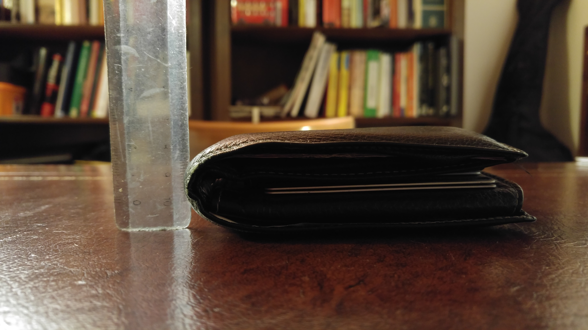
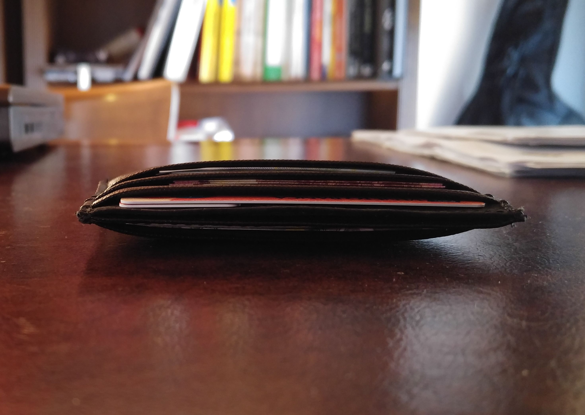
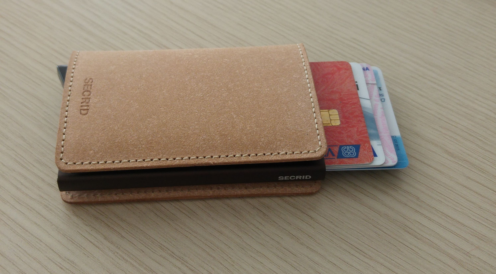
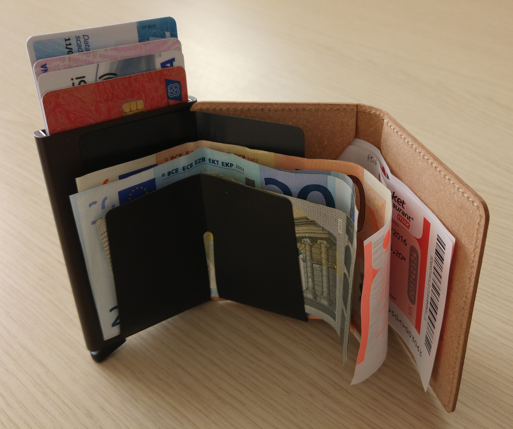

Qualche mese fa mi sono guardato allo specchio, con addosso un abito formale estivo.

Il portafoglio gonfiava in modo ridicolo qualunque tasca, sia quella posteriore dei pantaloni, sia quella interna della giacca... _Fastidio._

Era ora di cambiare portafoglio!

# Confronto

Questo è il mio vecchio portafoglio (12x9.5cm, spessore=3.5cm):  

Questo è stato per pochi giorni il mio portafoglio _provvisorio_ (10x7cm, spessore=2cm):  

Questo è il mio portafoglio _definitivo_, il [SECRID Slimwallet](https://www.mukama.com/en/secrid-slimwallet) (9.5x6.5cm, spessore=1.5cm):

Confrontando le misure, ecco i risultati:

            | Area | Spessore | Volume
--------------------------------------
Vecchio     | 100% |   100%   |  100%
Provvisorio |  61% |    57%   |   35%
**Nuovo      ** |  **54%** |    **42%**   |   **23%**

Insomma: spessore di _metà_ e un volume di _un quarto_ rispetto al portafoglio ciccione che avevo!  
C'è da dire che questo portafoglio è uno dei più **spessi** tra quelli che avevo individuato (vedi sotto): rinunciando al _card-protector_ in alluminio è possibile ottenere misure ancora più contenute.

# Risorse online

Come sempre faccio, sono partito da un meticoloso (... maniacale ;-) ) studio online: decine di recensioni, video, e siti web.

Ho scoperto subito che "ridurre il portafoglio" è un argomento che interessa da anni una montagna di persone, e che ha generato tantissime idee e prodotti. E quando dico "tantissime" intendo dire che ad esempio su KickStarter i [progetti sul tema "wallet"](https://www.kickstarter.com/projects/search?term=wallet) sono più di MILLE!

Il [sito della Bellroy](http://bellroy.com) forse è stato il mio primo approdo - uno dei rarissimi casi in cui devo aver cliccato su un banner pubblicitario, tra l'altro. Mi è servito per farmi un'idea iniziale di massima sull'argomento.

Più recentemente, mi sono informato soprattutto tramite le ottime (e rilassanti :-) ) [video-recensioni di Steve Montelli](https://www.youtube.com/user/montelli101), il sito [SlimWalletJunkie](http://www.SlimWalletJunkie.com) (che vende anche alcune marche interessanti, ed essendo lo store in Europa non ci sono spese di spedizione elevate né tasse doganali da temere), e [decine di altri video su YouTube](https://www.youtube.com/results?search_query=slim+wallet+review).

# Cosa ho scelto

Il portafoglio "provvisorio" che si vede in foto sopra è una cinesata omaggio di qualche negozio, che ho usato per qualche giorno in attesa che mi arrivasse il [SECRID Slimwallet](https://www.mukama.com/en/secrid-slimwallet)  
che ho comprato sul sito [Mukama](http://www.mukama.com).

## Pro

La mia scelta è caduta su questo portafoglio per questi motivi:

- Ha il _card-protector_ Secrid, che è un **meccanismo di protezione + espulsione delle card** con una levetta: quando sei alla cassa e devi pagare, è davvero comodo e veloce (oltre a proteggere le card da sollecitazioni meccaniche e da [furti di dati via RFID/NFC scanning](https://www.youtube.com/watch?v=ko7QzSfRxmM) - non cercavo questa funzionalità, ma già che c'è...).

- **Protegge completamente il contenuto**: non mi piacciono granché le soluzioni che lasciano sporgere le card o le banconote, perché rendono scomodo togliere il portafoglio dalla tasca, col rischio che i bordi di banconote/card si impiglino al tessuto del pantalone. E comunque mi piace un po' di discrezione in generale, quando estraggo il portafoglio per pagare o lo appoggio sul tavolo mentre sono al PC.

- Ha lo spazio per conservare le **banconote aperte**, in modo che sia possibile aggiungerne/toglierne quante ne servono con una sola mano (mentre l'altra tiene il portafoglio) e anche semplicemente capire a colpo d'occhio quanti e quali contanti si hanno. Questo fattore è stato fondamentale per la mia scelta, e fa la differenza rispetto alle soluzioni che obbligano a piegare le banconote 1 o 2 volte, e a scavare in una taschina per recuperarle.

- Ha l'esterno in **pelle**. Lo scrivo perché non è scontato, ci sono molti prodotti di queste dimensioni che sono in tessuto, in metallo, in carbonio, eccetera. L'idea dell'oggetto in pelle mi piaceva.

- Ha **ulteriori 2 slot formato card**, nei quali ci metto la card che apre il garage dell'ufficio (se la tenessi nel _card-protector_ di alluminio non verrebbe rilevata), i buoni pasto aperti, e ci parcheggio eventuali scontrini fino a quando raggiungo casa/ufficio per spostarli al loro posto.

## Contro

Ci sono anche alcuni CONTRO, rispetto ad altri modelli "minimal" che avevo addocchiato (e che elenco più sotto):

- Il _card-protector_ in alluminio ha il suo spessore, che resta quello anche se ci si mette dentro un numero di card inferiore. Nel mio caso, 5 card di cui la VISA con le cifre in rilievo sono _esattamente_ quelle massime previste per il _card-protector_.

- L'alluminio scherma anche le card inserite negli slot della parte in pelle: quindi per far rilevare una card senza estrarla è necessario inserirla nello slot laterale, ed appoggiare il portafoglio al lettore aprendolo leggermente. In alternativa, è sufficiente inserire tale card nel _card-protector_ per ultima, in modo che venga estratta quanto più possibile: al momento sto facendo così ed è molto comodo.

- Le banconote sono scomode da estrarre ed inserire, rispetto ad un portafoglio convenzionale, perché le estremità sono sempre un po' "arricciate" a causa della chiusura del portafoglio. Il sistema è comunque più rapido rispetto ai portafogli che costringono a piegarle.

# Cosa è cambiato

Questi sono i contenuti irrinunciabili nella mia vita quotidiana che ho traghettato dal vecchio al nuovo portafoglio:

- **Banconote**: poche! Tento di pagare sempre con le card, e di conservare un minimo di banconote con me solo per quando servono.

- **5 card**: Bancomat, VISA, Patente, Carta di Identità, Card per accesso a park ufficio.

Tutto qua!  
Più corposo invece l'elenco dei contenuti del mio vecchio portafoglio ai quali ho rinunciato:

- **Monete**: maledette! Ho spezzato varie card negli anni, compresi bancomat e patente, per colpa delle monete conservate nell'apposita tasca interna al portafoglio, e di me che per l'ennesima volta mi ci siedo sopra senza pensarci: le monete premono sulle card più vicine e... _crack_!  
    Adesso tengo le monete in tasca fino a quando arrivo all'auto, al giubbotto, al borsello, alla chiavetta del caffé o a casa - ecco le destinazioni per le mie monete.  
    Rinunciare alle monete DENTRO al portafoglio è stata la scelta più difficile, perché l'idea di avere i soldi "divisi in 2 posti" (monete da una parte e banconote+card dall'altra) invece che "tutti insieme" non mi era intuitiva.

- **Tessera sanitaria**: nell'unico posto dove la usavo (farmacia) posso usare la Carta di Identità Elettronica al posto della Tessera Sanitaria. Quindi la lascio a casa, e tengo una scansione in JPG e un'altra in PDF in Google Drive pronte per l'uso in caso di emergenza (mai successo finora).

- **Card Maestro aggiuntiva**: mai usata, perché ho già il mio Bancomat che supporta lo stesso circuito.

- **2 tessere carburante**: le lascio in auto, dato che in ogni caso posso usarle solo per rifornire l'auto aziendale.

- **Tessere fedeltà varie**: non sono un cliente così assiduo da accumulare chissà quanti punti, e soprattutto il valore dei regali/sconti che potrei ottenere è ampiamente superato dai benefici di un portafoglio più snello.

- **2 biglietti da visita**: sempre portati nel portafoglio, "_just in case_", e in realtà mai usati, perché li prelevo sempre dalla borsa di lavoro... dove non sono rovinati da mesi di permanenza in un portafoglio!

- **Scontrini dei pranzi**, accumulati fino a fine mese per la nota spese: quando devo consegnarli, sto usando il mio notebook, quindi ho vicino a me la relativa borsa, quindi gli scontrini posso raccoglierli in una tasca della borsa, spostandoceli entro pochi minuti dalla fine di ciascun pranzo. Non aveva alcun senso portarmeli dietro quotidianamente!

- Accumulo **scontrini per eventuali garanzie/resi** di quanto acquistato: discorso analogo a quello appena fatto per gli scontrini dei pranzi, ma spostato a casa. Lo svuotamento di questa area del portafoglio tra l'altro avveniva molto di rado, diciamo 2-3 volte l'anno, e mi è capitato varie volte di estrarre scontrini ormai illeggibili da quanto erano sbiaditi...

- Accumulo di **altre carte regolarmente dimenticate** (es. biglietti da visita di ristoranti e hotel): 100% fuffa, da buttare immediatamente. Se proprio merita, allora faccio una foto col cellulare e poi cestino.

Oltre a tutto questo contenuto inutile, c'erano anche gli **N strati di pelle e nylon** che componevano il vecchio portafoglio, per consentire la suddivisione dei contenuti in linguette e tasche varie.  
La disposizione "per taschine" delle varie card nei portafogli classici fa sì che queste si dispongano leggermente inclinate una sull'altra, con queste due conseguenze: maggiore ingombro e maggiori rischi di piegarle/rovinarle nel caso ci si sieda sopra, perché il bordo di una card fa pressione sul corpo di quella adiacente: molto meglio conservarle "impaccate" una sull'altra, specie tenendo conto che la maggior parte delle card vengono usate molto raramente, quindi l'averle "rapidamente riconoscibili" attraverso la disposizione per taschine non serve a granché.

Peggio ancora faceva la **tasca dedicata alle monete**: strati di portafoglio aggiuntivi, bottone metallico, e relativo rivetto metallico sotto per l'aggancio! Spessore e rischio danni alle card che è un piacere aver abbandonato.

Insomma, la soluzione in sintesi è stata questa:

> Niente tessere extra, niente monete, niente carte/cartine parcheggiate per settimane.

# Altri modelli interessanti

- [Trove Wallet](https://www.trove.cc) ([shop](http://www.slimwalletjunkie.com/collections/trove)): formato card, la fascia elastica consente di inserirci da 1 a 10 card mantenendo sempre lo spessore minimo, ha altre 2 tasche sui lati, e può essere rivoltato come un calzino (letteralmente!) per usarlo ad esempio come supporto per lo smartphone. Inoltre esiste in un gran numero di varianti di colore, anche configurabili online. Forse un po' meno "raffinato" rispetto ad altre scelte, ma secondo me è un'idea pratica e intelligente. Inoltre il fatto che sia composto soprattutto dalla fascia elastica rende l'estrazione delle card piuttosto pratica, allargando a piacere il portafoglio, e consente anche di tenerci qualche moneta senza farla scivolare fuori.

- [Elephant LR Wallet](http://elephantwallet.com/collections/lr-wallet): molto simile al Trove, tranne per queste differenze sostanziali: 2 taschine piccole aggiuntive a misura di monete/simcard/SD card, la pelle è sintetica, e... costa 1/3!

- [Dash 4.0](http://dashwallets.com): formato "card", tasca per banconote, slot per la card di uso più frequente, tasca elastica per altre 10+ card, protezione RFID. Spessore di 5mm.

- [Urban Slim Wallet 2.0 PLUS](http://urbangearpro.com/urban-slim-wallet-2-0-plus/) ([video](https://youtu.be/T3xS55nF-0A) | [KickStarter](https://www.kickstarter.com/projects/urbangearpro/urban-slim-wallet-20-with-rfid-protection?ref=users)): formato "card", ma con una parte aggiuntiva leggermente più grande in cui mettere le banconote piegate, e che si apre "ad angolo" per usarle con la massima praticità. La parte per le card è elastica, e tiene salde da 1 a 10 card. Ha anche 2 slot "quick draw", per estrarre con un colpo di pollice le 2 card più usate.  
    Caratteristiche interessanti, però lo spessore di 8mm è maggiore rispetto ad altre alternative più _minimal.  
    _Il portafoglio esiste in 2 misure, e la più grande (la PLUS) riesce a contenere anche gli Euro piegati una sola volta - mentre la misura più piccola è troppo bassa e richiederebbe di piegare una volta in più le banconote, e a questo punto diventano forse più interessanti altre scelte.

- [Nivisto Annandale](https://www.etsy.com/listing/234964859): formato "banconota piegata", pelle di canguro (sottilissima), tasca centrale apribile "ad angolo" per le banconote (piegate una volta), più 2 taschine laterali per contenere fino a 12 card in totale.

- [Slimmy 2](http://www.koyono.com/collections/slimmy-minimal-front-pocket-wallets/slimmy-redux): formato "banconota piegata" e apertura ad angolo, e vari formati tra cui scegliere. Il formato secondo me più interessante è quello "X Slimmy 2", che ha una unica tasca di dimensione adeguata agli Euro, al cui interno ci sono anche 2 slot per 2 card (le altre card vanno affiancate alle banconote). La pelle sembra spessa, ma essendocene solo 2 strati il risultato è spesso solo 5mm.

- [Svelte Wallet](http://sveltewallets.com/) ([video](https://youtu.be/6PeoBq3pYRg?t=55)): probabilmente la scelta più sottile possibile (grazie al materiale usato, il [Tyvek](https://it.wikipedia.org/wiki/Tyvek), che è poco più spesso della carta). Combina le dimensioni minime con la possibilità di conservare le banconote distese. L'altro lato della medaglia è che il Tyvek si rovina presto, assumendo un aspetto molto _cheap_.

- [Slimfold Wallet](http://www.slimfoldwallet.com/): simili agli Svelte appena descritti, ma in 2 formati e in 2 materiali diversi. Dei 2 materiali, il più interessante è il "Soft Shell", dall'aspetto forse meno _cheap_ rispetto al Tyvek. Belli entrambi i formati, sia l'Original che il Micro: l'Original si distingue perché può conservare molte card _affiancate_, quindi l'area è maggiore, e lo spessore anche da chiuso è davvero minimo. Da considerare che, se si hanno 8 card o meno, l'Original in Tyvek si può piegare anche in 4, ottenendo così un "formato card" il cui spessore probabilmente resta comparabile con gli altri modelli "formato card" in materiali diversi. Il formato Micro è più piccolo, e costringe a piegare le banconote più larghe (quelle da 50€ 100€ 200€ 500€): potrebbe essere un compromesso accettabile per ottenere un volume così minimale, scegliendo la versione Soft Shell; invece la versione in Tyvek se la gioca secondo me con lo Svelte Wallet, che non richiede trattamento diverso per le banconote più grandi, e nasconde le banconote completamente (invece lo Slimfold Micro lascia la parte superiore esposta alla vista, quando è aperto).

- [Invisible Wallet](http://www.invisiblewallet.eu/): formato "card", però in metallo: quindi protezione RFID e meccanica garantite. Bello il sistema di estrazione card "a ventaglio" per scegliere quella che serve. Può fungere anche da mini-stand per tenere sollevato lo smartphone. Le banconote vanno messe in mezzo alle card, piegate un paio di volte. Interessanti anche gli accessori.

- [Secrid Cardslide](https://www.mukama.com/en/secrid-cardslide-wallet): stesso "cuore" _card-protector_ in alluminio dello Slimwallet che ho scelto, mentre per "il resto" ci sono un cassettino di plastica e una banda elastica. Il cassettino potrebbe essere un'idea interessante per metterci qualche spicciolo, con la sicurezza che non rovini le card anche sedendosi sopra al portafogli, ma poi l'idea che le monete facciano rumore muovendosi mentre cammino mi ha dissuaso. Inoltre il formato "card" obbliga a piegare le banconote due volte - sia che le si metta nel cassettino, sia che le si tenga ferme con la banda elastica.

- [Bellroy](http://bellroy.com) produce modelli in pelle di ogni tipo e dimensione, e online gode di buona reputazione sul fronte della qualità dei materiali e della lavorazione, anche se non sono così _minimal_ e sottili. Il catalogo Bellroy è molto fornito, ma secondo me i modelli più interessanti sono lo [High Line](http://bellroy.com/wallets/high-line-wallet) e il [Note Sleeve](http://bellroy.com/wallets/note-sleeve-wallet): entrambi conservano le banconote distese, il primo è più minimalista, mentre il secondo è più accessoriato ma forse leggermente più spesso.

- [Cavity Card](http://www.slimwalletjunkie.com/collections/cavity-card/products/cavity-card-slim): segnalo questo accessorio che potrebbe essere furbo per qualunque micro-portafoglio in formato "card", per metterci dentro qualche spicciolo (o altri oggetti piccoli e sottili, come una sim, una chiave, o una micro-chiavetta usb).
