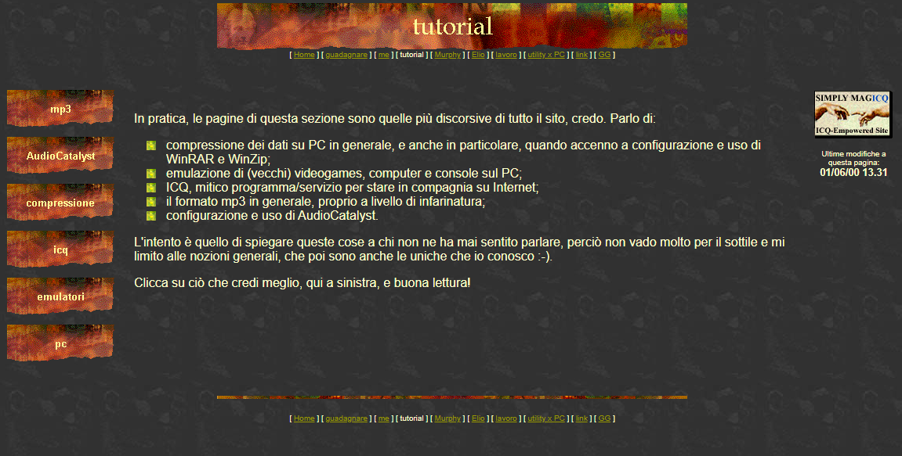
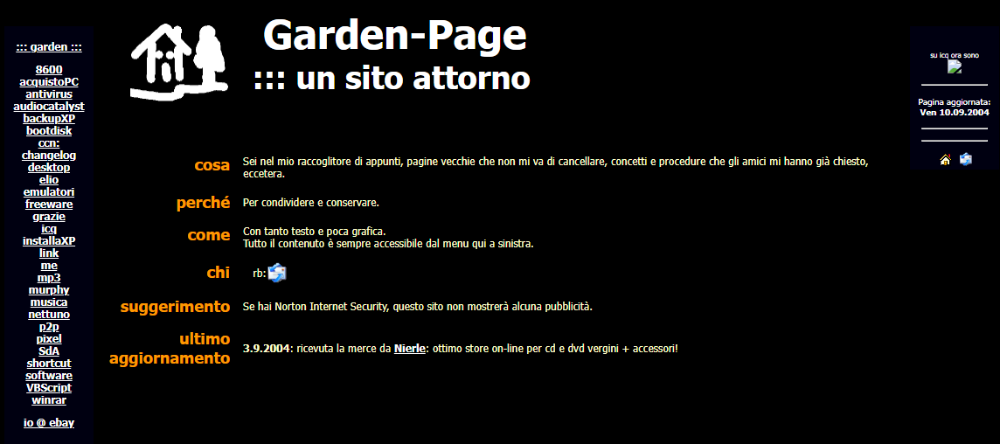
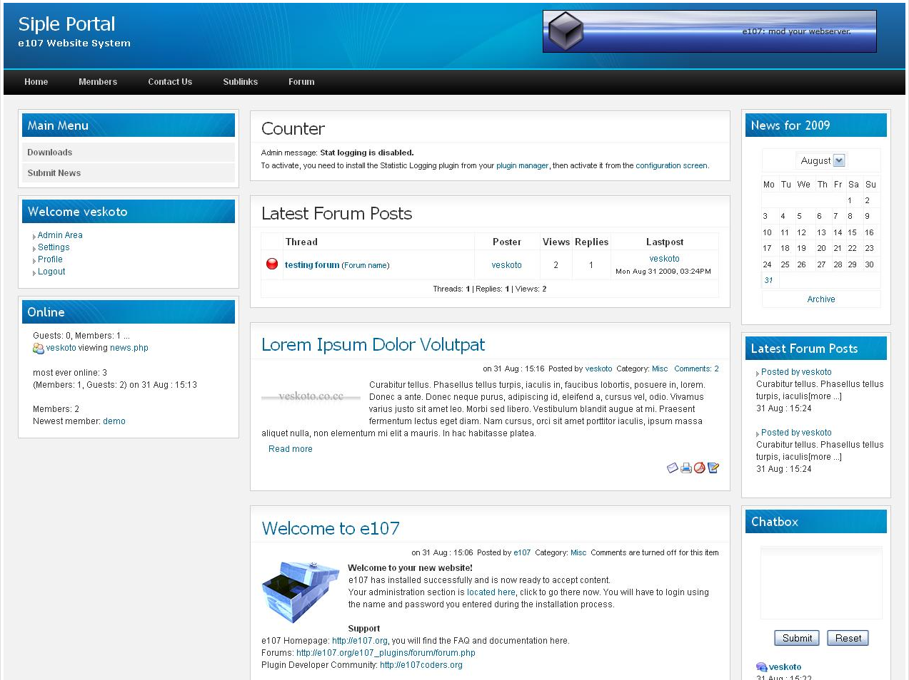
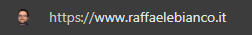
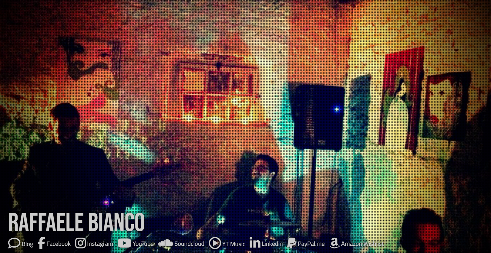
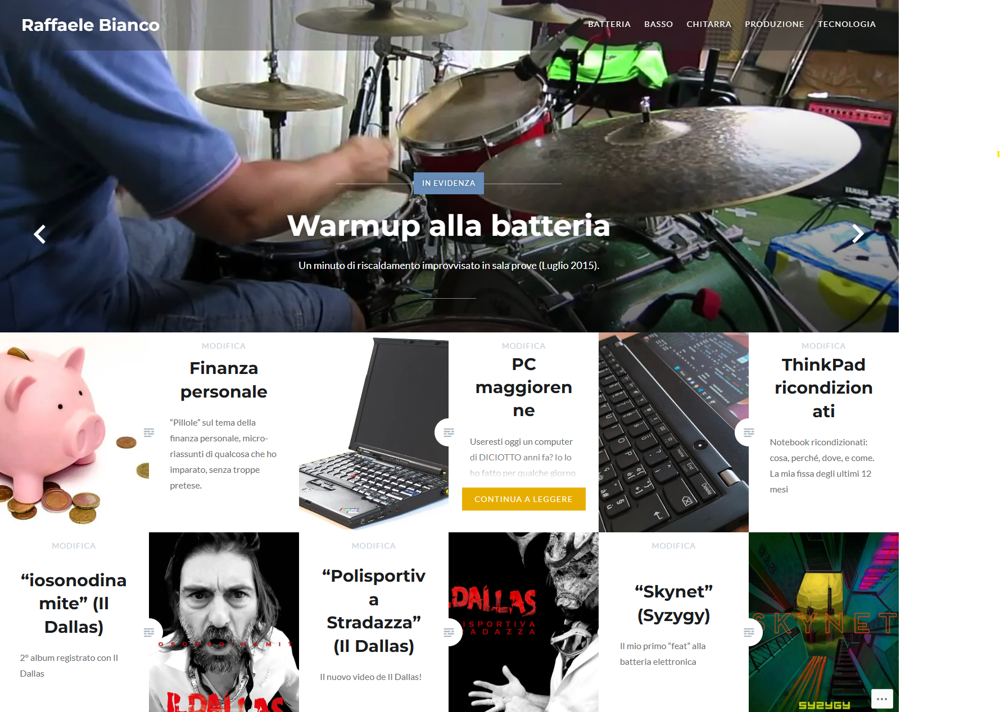

Ogni tanto queste pagine cambiano forma, perché le uso anche come palestra per smanettare con qualche strumento nuovo nei periodi nerd che ogni tanto mi prendono.

Ecco quindi la **storia di questo sito da quando è nato ad oggi**, attraverso tutte le sue reincarnazioni, in un impeto di amarcord che mi ha fatto venir voglia di scrivere un po' di ricordi.

# 1996: HTML artigianale

Era circa il 1996, avevo iniziato l'università e, come più o meno tutti i miei compagni di corso, frequentavo il [DEI](https://www.dei.unipd.it), il Dipartimento di Elettronica e Informatica dell'Università, in particolare il laboratorio che c'era appena dentro a sinistra, con dentro un vago sentore di persone che si lavano poco e una quindicina di [SPARCstation](https://en.wikipedia.org/wiki/SPARCstation), e **muovevo i miei primissimi passi sia su UNIX che su Internet**.  
In quel periodo Internet stava iniziando ad entrare nelle case italiane, ma ancora in nessuna di qualcuno che io conoscessi.  

Oggi è scontato avere tutto in tasca, ma nel '96, seduto davanti a un computer, ero per la prima volta in contatto col mondo intero.  
Ricordo ancora l'**euforia dei primi scambi di messaggi sui** [**newsgroup Usenet**](https://it.wikipedia.org/wiki/Newsgroup) con ignoti che vivevano chissà dove nel mondo, discutendo di batteria, tramite un software a caratteri che si chiamava [Pine](https://en.wikipedia.org/wiki/Pine_(email_client))... era tutto incredibile, per me che passavo dal paesetto di 20mila abitanti alla città con centinaia di studenti e questo accesso ad un universo parallelo, ogni nazione sembrava vicina, a portata di mano, ogni persona raggiungibile, lo raccontavo con entusiasmo ma in pochi capivano.

Appena ho realizzato che potevo avere un mio sito personale online ho imparato a farmelo.  
**Scrivevo in HTML a mano con un editor di testo**, forse addirittura prima di scoprire gli editor con la colorazione della sintassi.  

Al tempo non li chiamavamo ancora "blog", penso non esistesse ancora questo concetto, li chiamavamo proprio "siti web".

Purtroppo non ho più una copia di quella versione primordiale, anche se me la ricordo vagamente con i suoi pulsanti colorati sulla sinistra.  
Negli [snapshot fatti da Internet Archive](https://web.archive.org/web/20000711041401/http://www.dei.unipd.it/~raff/index.htm) mancano quasi tutti gli elementi grafici, è rimasto solo il testo.

La prima pubblicazione la feci nello spazio web fornito gratuitamente dall'Università di Padova agli studenti.  
Poi una volta lasciata l'Università ricordo che spostai tutto il contenuto prima su [Lycos](https://it.wikipedia.org/wiki/Lycos) e poi su Tiscali, che come tanti altri fornivano hosting gratuito in cambio di un po' di spazio nelle tue pagine dove infilare banner pubblicitari.

# 2000: Frontpage

Ad un certo punto rimasi favorevolmente colpito da Frontpage (orrore!) con il quale pensavo di migliorare ed estendere il mio sito con qualche automatismo in più. Pessima decisione!

Qualche tempo dopo sostituii Frontpage con Dreamweaver e persi ore preziose tentando di pulire le porcherie nel codice HTML prodotto dall'editor Microsoft che chi ci ha lavorato ricorderà sicuramente.

# 2004: minimalismo

Nel 2004 ripresi tutto il sito per farlo a mano senza FrontPage né Dreamweaver, e puntando al minimalismo, con pochi colori e il menu senza struttura.

Ho ancora questa versione zippata, se mi salta il matto pubblico le pagine qua dentro un giorno.

# 2005: CMS

La prima versione [dinamica](https://it.wikipedia.org/wiki/Pagina_web_dinamica) del mio sito vide la luce nel periodo d'oro dei forum online, nei primi anni 2000: imparai cosa fosse uno [stack LAMP](https://it.wikipedia.org/wiki/LAMP), come installarne uno, come smanettarci per quello che serviva a me, comprese modifiche, backup e restore dei database MySQL, e testai qualche [CMS opensource](https://www.opensourcecms.com).

Ne scelsi uno che si chiamava [e107](https://e107.org), chissà perché, con questo nome strambo poi. Sicuramente mi interessava il fatto che era una cosa farcita di funzionalità, per esempio mettevo a disposizione i miei script fatti in VBS nell'area Download, linkavo le news di altri siti tramite RSS, avevo il feed della mia mailing list "rb_barze" tramite la quale giravo barzellette e cazzatine varie a qualche decina di iscritti, ma soprattutto potevo avere **il mio forum personale**.  
Al tempo ero un assiduo frequentatore di forum, strumento che ancora oggi resta nettamente superiore rispetto ai social per discutere in modo più costruttivo e trovare informazioni, dato che chi ci scrive è portato ad organizzare pensieri più lunghi e strutturati rispetto ai banali commenti nei social, e questa maggiore articolazione dei pensieri è già un filtro automatico per molti trogloditi.  
Al tempo poi i social proprio non esistevano, quindi il mio chiodo fisso di interagire online con chi veniva a leggersi i miei contenuti aveva la sua massima espressione in questo tipo di strumento.

Ci smanettai un bel po', fino a pubblicare online il mio sito con l'aiuto di un amico che mi hostava questi esperimenti gratuitamente.  
**Sognavo interazioni con visitatori ed amici** ai quali giravo il link dei nuovi articoli che a volte scrivevo invece di rispondere a una domanda che mi avevano fatto, chissà che qualcun altro si unisse alla conversazione e tutto fosse utile a tutti. 

Qualche rimasuglio resta nella [Internet Archive Wayback Machine](https://web.archive.org/web/20060512224437/http://rb.asdasd.it/news.php), ma non c'è la grafica né i contenuti oltre la pagina visualizzata, il che è abbastanza normale trattandosi di un sito dinamico.

Una continua serie di **problemi di sicurezza di e107** richiedeva molta più dedizione di quella che ero disposto a mettere in campo, perché bisognava installare le patch di e107 e spesso qualcosa si rompeva, richiedendo ore di analisi e tentativi per provare a ripristinare quello che fino al giorno prima andava perfettamente.  
La frustrazione causata da tutto questo mi portò ad **abbandonare completamente il progetto e cancellare tutto**.  

Nel frattempo **i tempi erano maturi per MySpace e tutta l'ondata del** [**Web 2.0**](https://it.wikipedia.org/wiki/Web_2.0).  Dopo l'iscrizione a MySpace pensavo che in futuro avrei pubblicato eventualmente solo su piattaforme di quel tipo, perché non avrei dovuto più pensare alla gestione ma solo al contenuto, e dove l'interazione tra persone mi sembrava il motivo d'essere di quella ondata di nuovi servizi - quanta ingenuità! il vero motivo d'essere è guadagnare sulle pubblicità propinate, naturalmente.

# 2007: dominio

Cancellato il mio sito fatto con e107, non avevo quindi alcun contenuto online.  

Ho scoperto che **c'era raffaelebianco.it disponibile, e me lo sono comprato** credo su aruba.it, "metti mai che serva un domani".

Nel frattempo mi iscrivevo a Facebook e a decine di altre piattaforme Web 2.0 negli anni, mentre MySpace lentamente moriva.

# 2014: landing page su Tophost

Parlando con un collega, mi suggerisce [Tophost](https://www.tophost.it) per avere un minimo di spazio online a costi davvero bassi.

Quindi decido di traslocare la gestione del dominio e di **pubblicare intanto una banale landing page** simile alle migliaia che oggi si trovano fatte con [Linktr.ee](https://linktr.ee/raffaelebianco) e relativi cloni, proprio perché ormai le poche cose che pubblicavo erano tutte nelle piattaforme mainstream (Facebook YouTube eccetera) e non mi interessava avere qualcosa più di un singolo punto di approdo da linkare alla bisogna.

Per l'occasione ho studiato e provato qualche template HTML5 gratuito, ne ho trovati alcuni di molto ben fatti.  
In quel periodo ho pensato spesso di mettere insieme un piccolo sito _single-page_, dove tutto si carica in una unica operazione e basta usare il menu per spostarsi da una zona all'altra. Considerato che avevo pochissimi contenuti, mi sembrava una soluzione snella, ma non mi ci sono mai messo.

Mi sono però dedicato a **perfezionare la mia homepage**: ho smanettato un po' con i CSS, ho scoperto [Font Awesome](https://fontawesome.com), ho scovato e incorporato un paio di JavaScript già pronti per l'uso, e alla fine ne è uscita la **homepage che c'è ancora oggi su** [**RaffaeleBianco.it**](http://www.RaffaeleBianco.it).

# 2015: blog su Wordpress

Girovagando online mi sono imbattuto in [Wordpress](https://www.wordpress.com).  
Anche questo fa parte dei CMS che avevo scoperto più di 10 anni prima, ma l'estetica moderna, i temi, i plugin, e l'orientamento alla forma "blog" (con categorie e tag) mi hanno conquistato.

E allora **ho creato il mio primo vero blog**, così da imparare a muovermi un po' anche in Wordpress, che è forse il protagonista del mercato di queste soluzioni.

In quella incarnazione del mio sito ho trasportato alcune cose che avevo già pubblicato nella versione "e107" recuperandole da un backup, giusto per avere un minimo di contenuto con cui giocare, e ho continuato aggiungendo le cose che trovi anche qui, per la maggior parte video che pubblicavo su YouTube, fino ai contenuti del 2023 compresi.

# 2024: sito statico con Hugo

La versione attuale di questo blog merita una pagina per conto suo: [Hugo](/blog/p/hugo).
